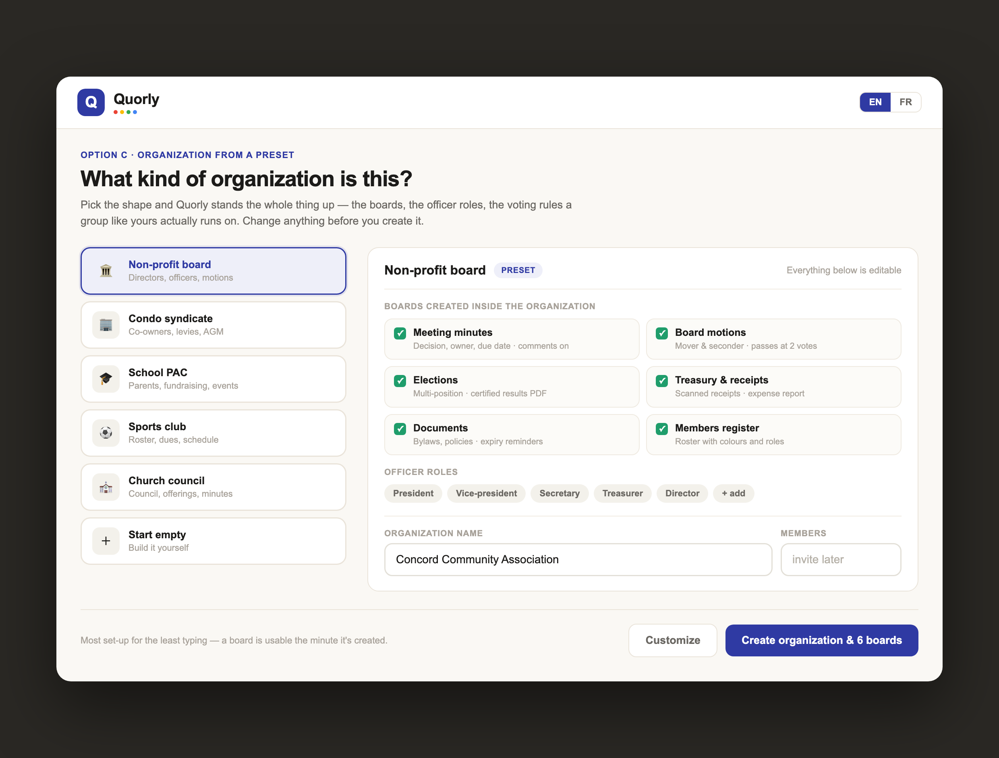

# Deploying Kolis / Quorly

Written 2026-08-28. A second machine tried to publish the organizations work that
day and could not — every function it built crashed on invocation — so this was
written as a handoff to **the machine that produced the last working deploys**.

**That deploy has since succeeded and quorly.ca is live** (all routes verified
200, including `/forms/new-org` and `/o/<slug>`). Same commits, same scripts,
different builder — which confirms the Node-version diagnosis in §3. Keep this
document: the traps in §3, §5, §6 and §7 are all still live, and the next person
to deploy will hit them.

---

## 1. What is already done — do NOT redo

- **Both database migrations are applied** to the Quorly Supabase project
  (`slhdhapvawjsinzplysd`) and verified:
  `20260828120000_quorly_org_departments.sql`,
  `20260828160000_quorly_org_legacy_kinds.sql`.
  They are recorded in `public.cf_migrations`, and `supabase/apply.mjs` skips
  anything already in that ledger, so re-running is a no-op — but there is no
  reason to run them at all.
- **The code is committed** on `ship-kolis-1.1.0`:
  `9c73139` (organizations & departments + the pending bilingual pass) and
  `2456396` (deploy scripts).
- **Netlify env vars are set** on `quorly-app` (all four Supabase vars). They had
  never been set anywhere — see §6.
- **quorly.ca is published and verified** — the organizations work is live.
  `business.kolis.ca` still runs its previous build; publish it only if the
  Kolis host needs the same code.

---

## 2. Get the code

The commits may still be local to the other machine. From there:

```bash
git push origin ship-kolis-1.1.0
```

Then here:

```bash
cd ~/repos/Kolis          # wherever this repo lives on this machine
git fetch origin
git checkout ship-kolis-1.1.0
git pull
git log --oneline -3      # expect 3809a76, 2456396, 9c73139
```

---

## 3. Check Node BEFORE building — this was the culprit

```bash
node -v
```

`netlify deploy --build` builds **on this machine**. `NODE_VERSION = "20"` in
`netlify.toml` only sets the *runtime* Netlify gives the deployed function — it
does not change the local builder. The machine that failed on 28 Aug was on
**Node 24**, and every function it built crashed on invocation. A machine on
Node 20 then deployed the identical commits successfully — same code, same
scripts, different builder — which is what confirmed the diagnosis.

- **Node 20.x** → proceed. This matches the runtime and matches the builds that
  are currently live and working.
- **Node 22+** → install and switch to 20 first (`nvm install 20 && nvm use 20`),
  or expect the failure in §5.

---

## 4. Deploy — TWO sites, one command each

quorly.ca and business.kolis.ca are **separate Netlify sites** built from the
same `admin-web` codebase. Publishing one does not publish the other. This was
missed for a while, which is why quorly.ca ran older code than the Kolis host.

| Site | Netlify site | Script |
|---|---|---|
| **quorly.ca** | `quorly-app` `5779f471-a3cc-4109-ba8a-d236a08ce9e3` | `./deploy-quorly.sh` |
| **business.kolis.ca**, admin.kolis.ca | `kolis-business` `da1cce8c-6a5b-4428-b46c-5267c0abc2a2` | `./deploy-prod.sh` |

```bash
npx netlify-cli login     # once, if not already authenticated
./deploy-quorly.sh        # the organizations work lives here
./deploy-prod.sh          # only if the Kolis host also needs the new build
```

Both scripts pass `--skip-functions-cache` and use `netlify-cli@latest`. Do not
remove either — see §7.

**Deploy to a draft first if you want a safety net.** Drop `--prod` from the
script's last line, or run it manually; you get a preview URL that does not
touch the live site. Test it the same way as §5, then re-run with `--prod`.

---

## 5. Verify — a green deploy is not proof

Netlify reports success even when the function is broken or missing routes.
Always check the routes themselves:

```bash
for p in / /forms /forms/new-org /o/shalo-family-documents /o/nope-not-real; do
  printf "%-42s " "$p"
  curl -s -o /dev/null -w "%{http_code}\n" -L --max-time 25 "https://quorly.ca$p"
done
curl -s -o /dev/null -w "kolis: %{http_code}\n" -L https://business.kolis.ca/
```

Expected: **every line 200**, including `/o/nope-not-real` (it renders a "no
organization at this address" card, which is a 200, not a 404).

Two failure signatures, with different causes:

- **404 on the new routes, 200 on `/forms`** → the deploy reused the cached Next
  function. It contains none of the new routes while existing pages keep working.
  Fix: make sure `--skip-functions-cache` is in the command.
- **502 on everything** → the function crashes on invocation. The body reads
  `error decoding lambda response: invalid status code returned from lambda: 0`.
  This is the 28 Aug failure. Roll back (§8) and see §3.

Also confirm Quorly is talking to the right database:

```bash
curl -s -L https://quorly.ca/forms -o /tmp/q.html
for c in $(grep -oE '/_next/static/chunks/[a-zA-Z0-9._/-]+\.js' /tmp/q.html | sort -u); do
  curl -s "https://quorly.ca$c"
done | grep -oE 'https://[a-z0-9]{20}\.supabase\.co' | sort -u
```

Expected: **`https://slhdhapvawjsinzplysd.supabase.co`** and nothing else.
If `kzjptcpjpwlxfofzhyku` appears, stop — see §6.

---

## 6. The Supabase env trap

`admin-web/lib/quorly.ts:9` falls back to the **Kolis** project when the Quorly
vars are unset:

```ts
const url = process.env.NEXT_PUBLIC_QUORLY_SUPABASE_URL || process.env.NEXT_PUBLIC_SUPABASE_URL!;
```

Until 28 Aug those vars were set on **neither** Netlify site — the working values
had only ever been inlined from a developer's shell at build time. A rebuild
would have silently pointed Quorly at the wrong database with no error anywhere.

They are now set explicitly on `quorly-app` (all four). If they ever go missing
again, the anon key is public and can be read straight out of the live bundle
with the command in §5.

Per Thomas (28 Aug), **business.kolis.ca should have nothing to do with Quorly** —
the Quorly vars were deliberately removed from `kolis-business`. That host still
serves `/forms` today; separating it properly (redirects, or splitting the
codebase) is outstanding work, not done here.

---

## 7. Why the scripts look the way they do

- **`netlify-cli@latest`, never `@17`.** The old pin bundles the current
  `@netlify/plugin-nextjs` into a function that returns nothing at runtime.
- **`--skip-functions-cache`.** Every page in this app — static ones included —
  is served by the Next runtime *function*, not by uploaded HTML. Netlify reuses
  that function from cache by default, which silently ships a build with no new
  routes in it. Costs ~30s per deploy.
- **Neither site is connected to GitHub.** Merges never auto-deploy; publishing
  is always manual via these scripts. Connecting the repo so Netlify builds in
  CI would also remove the local-Node problem in §3 — probably the right fix.

---

## 8. Rollback

Fastest recovery, restores instantly, needs a Netlify personal access token
(app.netlify.com → User settings → Applications):

```bash
SITE=5779f471-a3cc-4109-ba8a-d236a08ce9e3       # quorly-app
DEPLOY=6a8ffbe32688d48af822bd60                 # known-good, 27 Aug
curl -s -X POST -H "Authorization: Bearer $NETLIFY_AUTH_TOKEN" \
  "https://api.netlify.com/api/v1/sites/$SITE/deploys/$DEPLOY/restore"
```

Known-good deploys to fall back to:

| Site | Deploy ID | Date |
|---|---|---|
| quorly-app | `6a8ffbe32688d48af822bd60` | 27 Aug |
| kolis-business | `6a91a30cd1c3f3354bf22e82` | 28 Aug |

To list recent deploys and pick another:

```bash
curl -s -H "Authorization: Bearer $NETLIFY_AUTH_TOKEN" \
  "https://api.netlify.com/api/v1/sites/$SITE/deploys?per_page=5" \
  | python3 -c "import json,sys;[print(d['id'],d['state'],d['created_at']) for d in json.load(sys.stdin)]"
```

Restoring is safe: it republishes an existing build and touches nothing else.
The database migrations are independent of which build is live — the old front
end works against the new schema, because `cf_my_spaces`, `cf_create_space` and
`cf_subforms` were kept as aliases.

---

## 9. The organization screen

`/forms/new-org` — the create-organization screen, chosen from three options on
27 Aug. This is the design it was built to:



**The idea: pick the shape and Quorly stands the whole thing up.** Choosing
*Non-profit board* creates the organization and six departments in one call, so
a group is working the minute it signs up instead of assembling a workspace from
empty parts. Nothing is locked in — the caption "everything below is editable"
is literal: departments can be unticked, renamed inline, and offices added or
removed before anything is created.

| On screen | What it is |
|---|---|
| Left column | The presets — non-profit board, condo syndicate, school PAC, sports club, church council, start empty |
| Departments grid | What gets created. The tick toggles it; the name is an input, so it can be renamed in place |
| **Offices** | The *posts* a member holds — President, Trésorier. Elections are run for these. An office is a seat, **not** a container; departments are the containers |
| Organization name / Members | Name is required; members optional, comma-separated. One invite covers every department |
| **Customize** | Reveals short name (the `/o/<slug>` handle), legal name, and organization colour |
| Create button | Counts what it will build — "Create organization & 6 departments" |

Two things that differ from the mockup, both deliberate:

- The mockup said "boards"; the shipped wording is **departments**, per Thomas
  on 28 Aug. "Office" was freed up to mean the post a person holds, which is
  what removed the ambiguity in the first place.
- The mockup showed a bare `quorly.ca/concord` handle. Shipped as
  **`quorly.ca/o/<slug>`** — a bare slug would collide with `/forms`, `/join`,
  `/login`, `/prospecting`, `/d` and `/s`.

The presets live in `admin-web/lib/presets.ts`, **not in SQL**, precisely so this
screen can edit every line of one before `cf_create_org` runs. Adding a preset or
changing which departments one creates is a change to that file alone.

---

## 10. What should be visible once this ships

On quorly.ca, signed in:

- The left rail leads with an **organization switcher**, then `ORGANIZATION`
  (Home · Members · Documents · Settings), then `DEPARTMENTS`, then `PERSONAL`.
- **`+ Organization`** opens the preset picker at `/forms/new-org`.
- Existing data appears as three organizations: *Concord Express Co Inc. Board
  Meetings* (department: Invoice / payment log; election: Board Election 2026),
  *Les Chauffeurs de 140.* (election: Election du bureau Chauffeur), and *Shalo
  Family Documents* (files only — its files are under the **Documents** tab).
- `quorly.ca/o/<slug>` resolves an organization link; members land straight in
  the app, non-members get an invite-code box.
